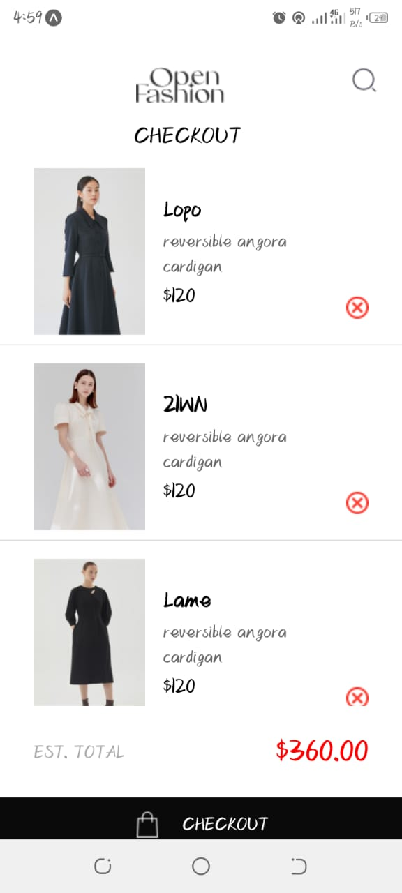

# rn-assignment6-11167338
 
# id- 11167338

## Overview
Greetings from the shopping app! You may shop more easily with the help of this React Native app. This is how it operates:

### Navigation
With just a few taps, you may easily navigate the app. The Home screen displays a selection of goods that can be bought. To view information and add a product to your shopping, simply tap on it. All of your selections are tracked on the Cart screen.

### Shopping Cart and Data Storage
AsyncStorage, a React Native local storage solution, safely stores the items in your shopping cart. Thus, even if you close the app, the contents of your cart remain intact. It's easy to add, remove, and see products in your cart, so your buying experience is smooth. 
 

### How It Works
**Navigation**: To go between seeing your cart and perusing products, use the buttons at the bottom of the page.
- **Adding products**: To add products to your cart, hit the add button on the Home screen.
- **Viewing Cart**: Go to the Cart screen to view the total cost of all the products you have chosen.
**Checking Out**: To finish your purchase, touch the checkout button on the Cart screen when you're ready.